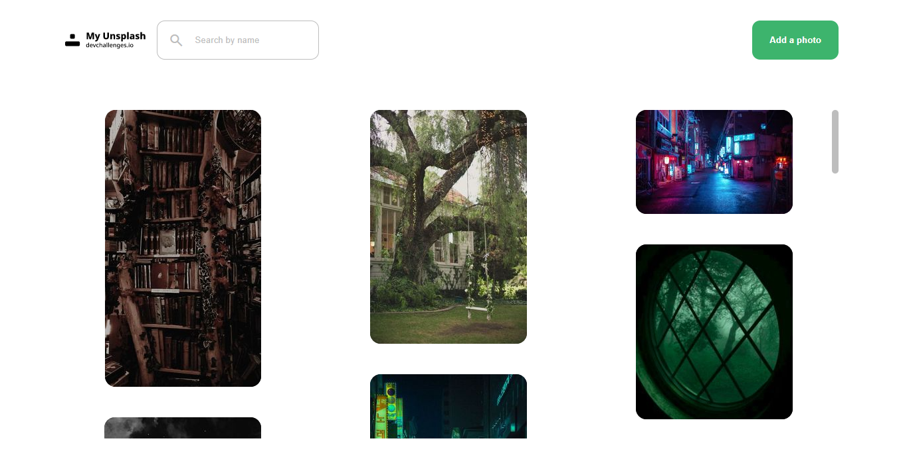

<h1 align="center">My Unsplash</h1>

<div align="center">
   Solution for a challenge from  <a href="http://devchallenges.io" target="_blank">Devchallenges.io</a>.
</div>

<div align="center">
  <h3>
    <a href="https://zippy-profiterole-eb6ac9.netlify.app/">
      Demo
    </a>
    <span> | </span>
    <a href="https://github.com/im-victor-mendez/React-My_Unplash">
      Solution
    </a>
    <span> | </span>
    <a href="https://devchallenges.io/challenges/rYyhwJAxMfES5jNQ9YsP">
      Challenge
    </a>
  </h3>
</div>

<!-- TABLE OF CONTENTS -->

## Table of Contents

- [Overview](#overview)
  - [Built With](#built-with)
- [Features](#features)
- [How to use](#how-to-use)
- [Contact](#contact)

<!-- OVERVIEW -->

## Overview

### Screenshot


### Video


### Built With

- [React.js](https://reactjs.org/)
- [Firebase](https://firebase.google.com/)

## Features

This application/site was created as a submission to a [DevChallenges](https://devchallenges.io/challenges) challenge. The [challenge](https://devchallenges.io/challenges/rYyhwJAxMfES5jNQ9YsP) was to build an application to complete the given user stories.

### Users can:
- See a list of photos in the masonry layout that have added.
- Add a new photo to the list.
- Search for photos by label.
- When hover a photo, see a label and a delete button.
- Delete images.

### To implement:
- Enter account password to delete image.

## How To Use

<!-- Example: -->

To clone and run this application, you'll need [Git](https://git-scm.com) and [Node.js](https://nodejs.org/en/download/) (which comes with [npm](http://npmjs.com)) installed on your computer. From your command line:

```bash
# Clone this repository
$ git clone https://github.com/your-user-name/your-project-name

# Install dependencies
$ npm install

# Run the app
$ npm start
```

## Contact

- LinkedIn [in/im-victor-mendez](https://www.linkedin.com/in/im-victor-mendez/)
- GitHub [@im-victor-mendez](https://github.com/im-victor-mendez)